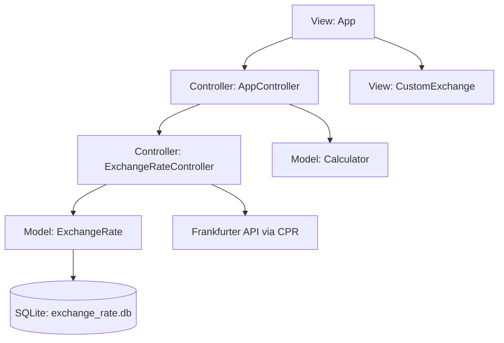

# Currency Exchange Rate Extension Plan

This document outlines the design and implementation plan to integrate real-time currency exchange rates from the Frankfurter API (`https://api.frankfurter.dev`) into the calculator's expression parser using a persistent SQLite cache and the modern **CPR (C++ Requests)** library.

---

## 1. Goal

Allow users to use currency exchange rates directly inside expressions (in the TUI) and via command-line arguments (in headless mode).

### Expression Syntax (TUI)
Write exchange rates directly in the expression input (supporting implicit multiplication):
```text
100 exchange(AUD, USD)
```
Evaluates to the value of 100 Australian Dollars in US Dollars (e.g. `70.43`).

### CLI Conversions (Headless Mode)
Convert currency values directly from the terminal. We support two approaches:

#### Approach 1: Inline exchange function
Write currency conversion functions directly in the expression argument:
```bash
calc_cli "2 + 2 exchange(AUD, USD)"
```
Computes the expression and fetches the exchange rate, outputting:
```text
2 + 2 exchange(AUD, USD) = 2.8172
```

#### Approach 2: Suffix conversion via `--exchange` flag
Specify the target currency pair using the `--exchange` flag (useful when piping a raw math expression):
```bash
echo "20 + 30" | calc_cli --exchange "(AUD,USD)"
```
This automatically appends ` exchange(AUD,USD)` to the parsed expression and evaluates it, outputting:
```text
20 + 30 exchange(AUD,USD) = 35.215
```

### Raw Value Conversion
Output only the calculated value using the `--value` flag:
```bash
calc_cli "50 exchange(AUD, USD)" --value
```
Outputs:
```text
35.215
```

### Piped Conversion
Piping an expression directly into the CLI tool:
```bash
echo "(20 + 30) exchange(AUD, USD)" | calc_cli
```
Outputs:
```text
(20 + 30) exchange(AUD, USD) = 35.215
```

To avoid blocking the TUI with network requests and to support offline execution, rates will be cached locally in a SQLite database. Cache entries older than 24 hours will be considered stale and re-fetched from the API.

---

## 2. Dependency Management (CMake)

We will fetch the modern **CPR** library and the **nlohmann/json** parser directly via CMake's `FetchContent`.

### Update `CMakeLists.txt`
```cmake
# Fetch CPR (C++ Requests)
FetchContent_Declare(
    cpr
    GIT_REPOSITORY https://github.com/libcpr/cpr.git
    GIT_TAG        1.10.4
)
# Disable building CPR tests and select system curl/SSL to speed up compilation
set(CPR_BUILD_TESTS OFF CACHE INTERNAL "")
set(CPR_USE_SYSTEM_CURL ON CACHE INTERNAL "")
FetchContent_MakeAvailable(cpr)

# Fetch nlohmann/json library
FetchContent_Declare(
    json
    URL https://github.com/nlohmann/json/releases/download/v3.11.3/json.tar.xz
)
FetchContent_MakeAvailable(json)

# Link them to calc_lib
target_link_libraries(calc_lib PUBLIC 
    util_lib 
    SQLite3::SQLite3 
    cpr::cpr
    nlohmann_json::nlohmann_json
)
```

---

## 3. Architecture Design

To maintain the project's strict MVC separation and support offline/unit testing of the parser, we will use a decoupled dependency injection architecture:

* **View: App** ➡️ Interacts only with `AppController` and delegates custom exchange inputs to `CustomExchange`.
* **View: CustomExchange** ➡️ Mutates the expression input and cursor location in AppState during custom exchange setup.
* **Controller: AppController** ➡️ Coordinates overall app execution and holds a reference to `ExchangeRateController`.
* **Controller: ExchangeRateController** ➡️ Responsible for checking the database cache, invoking the `cpr` library to perform network requests when the cache is missing/stale, and writing updated rates back to the database.
* **Model: ExchangeRate** ➡️ Handles local SQLite database CRUD operations for cache records. Has zero network dependencies.
* **Model: Calculator & Parser** ➡️ Evaluates expressions, invoking a resolver callback to fetch exchange rates without needing to know about curl, controllers, or database paths.



---

## 4. Cache Database Model (`ExchangeRate`)

We will create the model class `ExchangeRate` to interface with a dedicated SQLite database located at `~/.calc_cli/exchange_rate.db`.

### Database Schema
```sql
CREATE TABLE IF NOT EXISTS exchange_rates (
    base_currency TEXT,
    quote_currency TEXT,
    rate REAL NOT NULL,
    last_updated DATETIME DEFAULT CURRENT_TIMESTAMP,
    PRIMARY KEY (base_currency, quote_currency)
);
```

### `src/model/exchange_rate.hpp`
```cpp
#pragma once

#include <string>
#include <sqlite3.h>

struct CachedRate {
    double rate;
    long long timestamp; // Unix timestamp of last update
};

class ExchangeRate {
  public:
    explicit ExchangeRate(const std::string& db_path);
    ~ExchangeRate();

    // Disable copy
    ExchangeRate(const ExchangeRate&) = delete;
    ExchangeRate& operator=(const ExchangeRate&) = delete;

    bool Initialize();

    // Retrieve cached rate if it exists
    bool GetCachedRate(const std::string& base, const std::string& quote, CachedRate& out_rate);

    // Save/Update rate in the database
    bool SaveRate(const std::string& base, const std::string& quote, double rate);

  private:
    std::string db_path_;
    sqlite3* db_ = nullptr;

    bool ExecuteQuery(const std::string& sql);
};
```

---

## 5. Exchange Rate Controller (`ExchangeRateController`)

`ExchangeRateController` manages retrieving rates, checking cache status, and fetching from the Frankfurter API using `cpr::Get`.

### `src/controller/exchange_rate_controller.hpp`
```cpp
#pragma once

#include "model/exchange_rate.hpp"
#include <string>

class ExchangeRateController {
  public:
    explicit ExchangeRateController(ExchangeRate& model);

    // Resolves exchange rate. Checks cache first; if missing or > 24 hours old,
    // fetches from Frankfurter API via cpr and saves to cache.
    double GetRate(const std::string& base, const std::string& quote);

  private:
    ExchangeRate& model_;

    double FetchFromAPI(const std::string& base, const std::string& quote);
};
```

### `src/controller/exchange_rate_controller.cpp`
```cpp
#include "controller/exchange_rate_controller.hpp"
#include <cpr/cpr.h>
#include <nlohmann/json.hpp>
#include <ctime>
#include <stdexcept>

ExchangeRateController::ExchangeRateController(ExchangeRate& model)
    : model_(model) {}

double ExchangeRateController::GetRate(const std::string& base, const std::string& quote) {
    CachedRate cached;
    long long current_time = std::time(nullptr);

    // If cache exists and is fresh (< 24 hours / 86400 seconds)
    if (model_.GetCachedRate(base, quote, cached)) {
        if (current_time - cached.timestamp < 86400) {
            return cached.rate;
        }
    }

    // Cache miss or stale -> Fetch from API
    try {
        double rate = FetchFromAPI(base, quote);
        model_.SaveRate(base, quote, rate);
        return rate;
    } catch (const std::exception& e) {
        // Fallback to stale cache if API call fails (offline support)
        if (cached.rate > 0.0) {
            return cached.rate;
        }
        throw; // rethrow if we have no fallback rate
    }
}

double ExchangeRateController::FetchFromAPI(const std::string& base, const std::string& quote) {
    std::string url = "https://api.frankfurter.dev/v2/rate/" + base + "/" + quote;
    
    // Execute a clean HTTP GET request using CPR
    cpr::Response r = cpr::Get(cpr::Url{url}, cpr::Timeout{5000}); // 5-second timeout
    if (r.status_code != 200) {
        throw std::runtime_error("Network request failed (status " + 
                                  std::to_string(r.status_code) + "): " + r.error.message);
    }

    try {
        auto json = nlohmann::json::parse(r.text);
        if (!json.contains("rate") || !json["rate"].is_number()) {
            throw std::runtime_error("Invalid API response format");
        }
        return json["rate"].get<double>();
    } catch (const std::exception& e) {
        throw std::runtime_error("Failed to parse exchange rate: " + std::string(e.what()));
    }
}
```

---

## 6. Parser Grammar Integration

We will extend the parser's grammar to support `exchange(BASE, QUOTE)` both as a primary factor and as an expression-level suffix operator. This design ensures that:
1. Standalone/prefix usage like `exchange(AUD, USD)` or `5 + exchange(AUD, USD)` evaluates properly.
2. Suffix usage like `2 + 4 + 7 * 9 exchange(AUD, USD)` behaves as if the entire preceding expression is wrapped in parentheses: `(2 + 4 + 7 * 9) * exchange(AUD, USD)`.

### Parser Grammar Rules

```text
Expression    -> SumExpression [ "exchange" "(" IDENTIFIER "," IDENTIFIER ")" ]
SumExpression -> Term ( ( "+" | "-" ) Term )*
Term          -> Factor ( ( "*" | "/" ) Factor )*
Factor        -> Number 
               | "(" Expression ")" 
               | "exchange" "(" IDENTIFIER "," IDENTIFIER ")"
```

*Note: Suffix syntax (e.g., `100 exchange(AUD, USD)`) is parsed at the outer `Expression` level rather than via implicit multiplication in `Term`, which naturally gives the suffix the lowest precedence. This guarantees that `2 + 4 + 7 * 9 exchange(AUD, USD)` correctly maps to `(2 + 4 + 7 * 9) * rate`.*

### Dependency Injection (Testability)
To ensure the parser remains fully unit-testable without triggering live network calls or database writes, we use a resolver callback type:

```cpp
using RateResolver = std::function<double(const std::string&, const std::string&)>;
```

### `src/model/parser.hpp`
```cpp
class Parser {
  public:
    Parser(const std::string& input, RateResolver resolver = nullptr);
    ...
  private:
    RateResolver rate_resolver_;
};
```

---

## 7. Calculator Interface Refactoring

We will pass the `RateResolver` to the `Calculator::Evaluate` method:

```cpp
// In src/model/calculator.hpp
class Calculator {
  public:
    EvaluationResult Evaluate(const std::string& expression, RateResolver resolver = nullptr);
};
```

---

## 8. Controller Integration

`AppController` will be aware of `ExchangeRateController` and inject its rate resolver lambda when evaluating expressions.

```cpp
// In src/controller/app_controller.hpp
class AppController {
  public:
    AppController(AppState& state, Calculator& calc,
                  HistoryController& history_ctrl,
                  ExchangeRateController& exch_rate_ctrl,
                  std::function<void()> on_quit);
    ...
  private:
    AppState& state_;
    Calculator& calc_;
    HistoryController& history_ctrl_;
    ExchangeRateController& exch_rate_ctrl_;
    std::function<void()> on_quit_;
};
```

### Updates to `OnEvaluate()`
```cpp
void AppController::OnEvaluate() {
    std::string formatted = util::FormatExpression(state_.expression_input);
    state_.expression_input = formatted;

    // Define resolver lambda that hooks into ExchangeRateController
    auto resolver = [this](const std::string& base, const std::string& quote) {
        return exch_rate_ctrl_.GetRate(base, quote);
    };

    EvaluationResult res = calc_.Evaluate(formatted, resolver);
    if (res.ok) {
        std::string result_str = util::FormatDouble(res.value);
        state_.result_display = "= " + result_str;
        state_.error_state = false;
        history_ctrl_.OnSaveHistory(formatted, result_str);
    } else {
        state_.result_display = "Error: " + res.error;
        state_.error_state = true;
    }
}
```

---

## 9. Headless Mode Integration

We will support exchange rate calculations in the headless/piped path of `main.cpp` by injecting the rate resolver callback.

### Updates to `RunHeadless`
```cpp
static int RunHeadless(const std::string& expr, bool print_only_value, 
                       HistoryController& history_ctrl,
                       ExchangeRateController& exch_ctrl,
                       const std::string& exchange_arg = "") {
    std::string final_expr = expr;
    if (!exchange_arg.empty()) {
        // Parse base and quote from exchange_arg, e.g. "(AUD,USD)" or "AUD,USD"
        std::string clean = exchange_arg;
        if (clean.front() == '(' && clean.back() == ')') {
            clean = clean.substr(1, clean.size() - 2);
        }
        auto comma = clean.find(',');
        if (comma == std::string::npos || comma == 0 || comma == clean.size() - 1) {
            std::cerr << "Error: Invalid exchange format. Expected (BASE,QUOTE)\n";
            return EXIT_FAILURE;
        }
        std::string base = clean.substr(0, comma);
        std::string quote = clean.substr(comma + 1);
        final_expr = expr + " exchange(" + base + "," + quote + ")";
    }

    std::string formatted = util::FormatExpression(final_expr);
    Calculator calc;
    
    auto resolver = [&exch_ctrl](const std::string& base, const std::string& quote) {
        return exch_ctrl.GetRate(base, quote);
    };

    EvaluationResult res = calc.Evaluate(formatted, resolver);
    if (!res.ok) {
        std::cerr << "Error: " << res.error << "\n";
        return EXIT_FAILURE;
    }

    if (print_only_value) {
        std::cout << util::FormatDouble(res.value) << "\n";
    } else {
        std::cout << formatted << " = " << util::FormatDouble(res.value) << "\n";
    }

    // Save calculation to history
    history_ctrl.OnSaveHistory(formatted, util::FormatDouble(res.value));
    return EXIT_SUCCESS;
}
```

### Updates to `main()` Argument Parser
```cpp
int main(int argc, char* argv[]) {
    bool print_only_value = false;
    std::string expr_arg = "";
    std::string exchange_arg = "";

    // Parse arguments
    for (int i = 1; i < argc; ++i) {
        std::string arg = argv[i];
        if (arg == "--stdin-file" && i + 1 < argc) {
            std::freopen(argv[i + 1], "r", stdin);
            i++;
        } else if (arg == "--value") {
            print_only_value = true;
        } else if (arg == "--expr" && i + 1 < argc) {
            expr_arg = argv[i + 1];
            i++;
        } else if (arg == "--exchange" && i + 1 < argc) {
            exchange_arg = argv[i + 1];
            i++;
        } else if (expr_arg.empty() && arg.find("--") != 0) {
            // Support passing raw expression without --expr, e.g. calc_cli "2 + 2"
            expr_arg = arg;
        }
    }
```

---

## 10. TUI Interface Design & Integration

We will add the new "Exchange" menu directly into the top-level FTXUI horizontal menu and define its sub-menu actions.

### ASCII Layout Specifications

**Top-Level Exchange Menu Active:**
```text
┌────────────────────────────────────────────────────────────┐
│ File  Edit  [Exchange]  Help                               │ <- "Exchange" active
├────────────────────────────────────────────────────────────┤
│ [AUD -> USD]  Custom                                       │ <- Sub-Menu items
├────────────────────────────────────────────────────────────┤
│  > 100 exchange(AUD, USD)                                  │ <- Expression Input
├────────────────────────────────────────────────────────────┤
│    = 70.43                                                 │ <- Converted Result
└────────────────────────────────────────────────────────────┘
```

**Custom Exchange Modal Dialog (Active):**
```text
┌────────────────────────────────────────────────────────────┐
│ File  Edit  [Exchange]  Help                               │
├────────────────────────────────────────────────────────────┤
│                                                            │
│       ┌──────────────────────────────────────────┐         │
│       │             Custom Exchange              │         │
│       ├──────────────────────────────────────────┤         │
│       │ Source Currency: [AUD                  ] │         │
│       │ Target Currency: [USD                  ] │         │
│       ├──────────────────────────────────────────┤         │
│       │           [  OK  ]    [ Cancel ]         │         │
│       └──────────────────────────────────────────┘         │
│                                                            │
└────────────────────────────────────────────────────────────┘
```

### UX & Sub-Menu Actions
These sub-menu actions act as convenient shorthands so the user doesn't have to type the function syntax manually:
* **AUD -> USD**: Instantly inserts the shorthand `exchange(AUD, USD)` at the current cursor position in the expression input, and positions the cursor at the end.
* **Custom**: Opens a modal dialog with input fields for **Source Currency** and **Target Currency**. Once the user fills them in and clicks **OK** (or presses Enter), it inserts `exchange(<source>, <target>)` at the current cursor position in the expression input. Clicking **Cancel** (or pressing Esc/closing) closes the modal without inserting any text.

---

## 11. Testing Strategy

We will test the parser grammar in complete isolation using mock rate resolvers:

```cpp
TEST_CASE("Parser - exchange function with mock resolver", "[parser]") {
    auto mock_resolver = [](const std::string& base, const std::string& quote) {
        if (base == "AUD" && quote == "USD") return 0.70;
        throw std::runtime_error("Unsupported currency pair");
    };

    Calculator calc;
    
    SECTION("Basic exchange lookup with implicit multiplication") {
        auto res = calc.Evaluate("100 exchange(AUD, USD)", mock_resolver);
        REQUIRE(res.ok);
        REQUIRE(res.value == 70.0);
    }

    SECTION("Expression-wide suffix precedence") {
        auto res = calc.Evaluate("2 + 4 + 7 * 9 exchange(AUD, USD)", mock_resolver);
        REQUIRE(res.ok);
        REQUIRE(res.value == 48.3); // (2 + 4 + 63) * 0.70 = 69 * 0.70 = 48.3
    }
}
```

We will also write unit tests for the `ExchangeRate` model using `:memory:` database configuration.

---

## 12. Expression Spacing Formatting

To ensure expression display looks professional in the TUI history and evaluation headers (e.g. `100 exchange(AUD, USD)` instead of `100exchange (AUD,USD)`), we will update `util::FormatExpression` to:
1. Detect the keyword `exchange` and insert a space before it if it is preceded by a number, parenthesis, or another identifier.
2. Ensure there is no space between `exchange` and its opening parenthesis `(`, yielding `exchange(`.
3. Automatically format commas to include a trailing space `, ` (yielding `AUD, USD`).

### `src/util/formatting.cpp` Refactoring

```cpp
std::string FormatExpression(const std::string& input) {
    std::string out;
    bool prev_is_operator = true; 

    for (size_t i = 0; i < input.size(); ++i) {
        char c = input[i];
        if (std::isspace(static_cast<unsigned char>(c))) continue;

        // Check for "exchange" keyword
        if (input.compare(i, 8, "exchange") == 0) {
            size_t next_pos = i + 8;
            if (next_pos >= input.size() || !std::isalpha(static_cast<unsigned char>(input[next_pos]))) {
                if (!out.empty() && (std::isalnum(static_cast<unsigned char>(out.back())) || out.back() == ')')) {
                    out += ' ';
                }
                out += "exchange";
                i += 7; // skip "exchange" characters (loop will increment i to i+8)
                prev_is_operator = false;
                continue;
            }
        }

        if (c == '+' || c == '-' || c == '*' || c == '/') {
            // ... operator formatting ...
        } else if (c == '(') {
            // Only add a space before '(' if it does not follow "exchange"
            if (!out.empty() && out.back() != ' ' && out.back() != '(' && out.back() != '-' && out.back() != '+' &&
                (out.size() < 8 || out.compare(out.size() - 8, 8, "exchange") != 0)) {
                out += ' ';
            }
            out += c;
            prev_is_operator = true;
        } else if (c == ',') {
            if (!out.empty() && out.back() == ' ') out.pop_back();
            out += ", ";
            prev_is_operator = true;
        } else {
            // ... rest of character formatting ...
        }
    }
    // ... trim trailing space ...
}
```

---

## 13. Custom Exchange Modal Component Refactoring

To maintain high code modularity and clean decoupling, the floating dialog box code for Custom currency conversion will be moved out of `app.cpp` into a dedicated view class `view::CustomExchange` in `src/view/custom_exchange.hpp/cpp`.

### Interface: `src/view/custom_exchange.hpp`
```cpp
#pragma once

#include <ftxui/component/component.hpp>
#include "model/app_state.hpp"

namespace view {

class CustomExchange {
  public:
    explicit CustomExchange(AppState& state);
    ftxui::Component GetComponent();

  private:
    AppState& state_;
    ftxui::Component component_;
};

} // namespace view
```

### Integration in `src/view/app.cpp`
We instantiate `CustomExchange` inside the `App` constructor:
```cpp
    auto custom_exchange_view = std::make_shared<view::CustomExchange>(state_);
    auto custom_modal = custom_exchange_view->GetComponent();
```

---

## 14. Implementation Checklist

- [ ] Add `cpr` and `nlohmann/json` `FetchContent` blocks to `CMakeLists.txt`. Include new source files in `calc_lib` and `controller_lib`.
- [ ] Implement `ExchangeRate` model in `src/model/exchange_rate.hpp/cpp` (storing database in `~/.calc_cli/exchange_rate.db`).
- [ ] Implement `ExchangeRateController` in `src/controller/exchange_rate_controller.hpp/cpp` (using `<cpr/cpr.h>`).
- [ ] Update `Parser` constructor and implementation to support `exchange(BASE, QUOTE)` and implicit multiplication.
- [ ] Update `Calculator::Evaluate` to accept a `RateResolver` and pass it to the parser.
- [ ] Refactor `AppController` to accept `ExchangeRateController` and pass its resolver lambda to `Calculator::Evaluate`.
- [ ] Add the database initialization helper inside `src/main.cpp` for the exchange rate database.
- [ ] Update `main.cpp` argument parser to accept `--exchange "(BASE,QUOTE)"` and append the suffix to the expression in `RunHeadless`.
- [ ] Implement the `view::CustomExchange` class in `src/view/custom_exchange.hpp/cpp` to encapsulate the custom exchange modal.
- [ ] Refactor `App` view in `src/view/app.hpp/cpp` to add the "Exchange" top-level menu, "AUD -> USD" / "Custom" submenus, and delegate the custom modal popup rendering to `CustomExchange`.
- [ ] Add `src/view/custom_exchange.cpp` to the `app_lib` library definition in `CMakeLists.txt`.
- [ ] Update `util::FormatExpression` in `src/util/formatting.cpp` to correctly format spacing around `exchange` keywords, parentheses, and commas.
- [ ] Instantiate `ExchangeRate` and `ExchangeRateController` in `main.cpp` and pass them to the evaluation paths.
- [ ] Write Catch2 tests for `ExchangeRate` model, mock resolution, TUI event integrations, and expression formatting.
- [ ] Compile and verify all tests pass.
```
