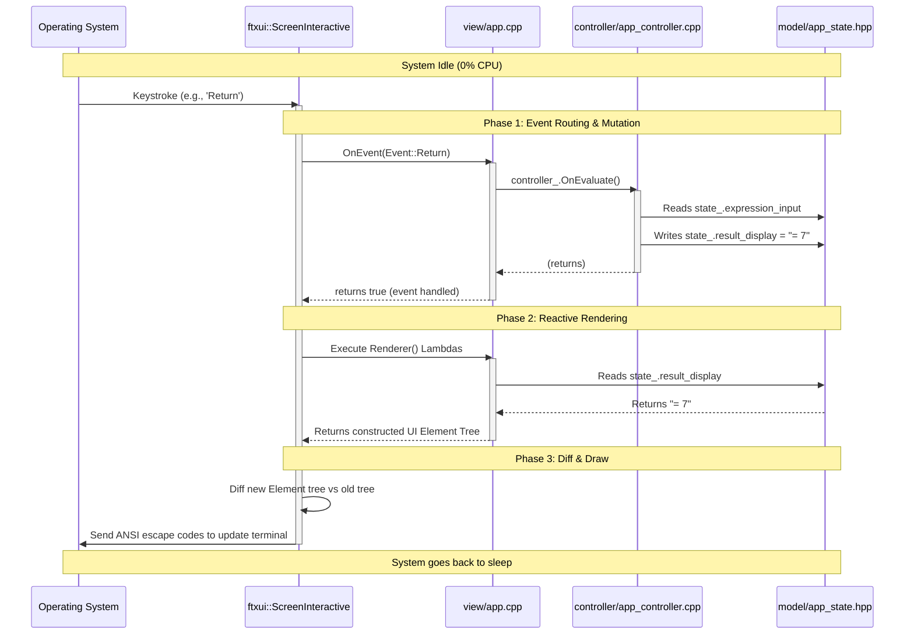

# FTXUI Event Flow and Rendering Cycle

This document explains the underlying mechanics of how FTXUI powers the `calc-cli` UI and keeps the screen synchronized with our state variables (like `std::string result_display;`).

## 1. The Core Concept: Event-Driven, Not Polled

A common misconception about TUI (Terminal UI) frameworks is that they run a continuous game-loop, polling variables on an interval (e.g., 60 times a second) to see if they've changed. 

**FTXUI does not poll.** It is entirely **event-driven**. 

When the application sits idle, it consumes 0% CPU. It only wakes up when the Operating System sends it an event (a keystroke, mouse click, or a terminal resize).

## 2. The Render Loop

When `screen.Loop(app.GetComponent())` is called in `main.cpp`, FTXUI enters a blocking lifecycle:

```mermaid
graph TD
    Start((Start Loop)) --> Sleep[Sleep & Wait for Input]
    
    Sleep -- OS Event (e.g. keypress) --> Wake[Wake Up]
    
    Wake --> Route[1. Route Event Down Component Tree]
    Route --> Mutate[2. Controller Mutates AppState]
    
    Mutate --> Render[3. Execute all Renderer() Lambdas]
    Render --> ReadState[4. Read fresh AppState variables]
    ReadState --> NewTree[5. Build new UI Element Tree]
    
    NewTree --> Diff[6. Diff New Tree vs Old Tree]
    Diff --> Draw[7. Write ANSI codes to Terminal]
    
    Draw --> Sleep
    
    style Sleep fill:#1a1a2e,stroke:#fff,color:#fff
    style Mutate fill:#3a0ca3,stroke:#fff,color:#fff
    style ReadState fill:#005f73,stroke:#fff,color:#fff
    style Draw fill:#b5179e,stroke:#fff,color:#fff
```

### Step-by-Step Breakdown

1. **Wait for input:** The main thread blocks, waiting for terminal input.
2. **Process Event:** When a key is pressed (e.g., `Return`), FTXUI catches it and sends it down our component tree. Our `CatchEvent` block intercepts it, calls `controller_.OnEvaluate()`, and returns `true` (signaling the event was handled).
3. **State Mutation:** The controller computes the math and overwrites `state_.result_display`.
4. **Re-render:** Because an event was processed, FTXUI assumes state *might* have changed. It traverses the UI tree again, executing our `Renderer` lambdas.
5. **Fresh Data:** Inside the lambda, the code simply reads `state_.result_display` directly. It always gets the latest string value.
6. **Diffing:** FTXUI generates a brand new layout tree in memory. It compares this new tree against the one it drew on the previous frame.
7. **Draw:** It calculates the exact minimal set of ANSI escape codes needed to change the old screen into the new screen (to prevent flickering) and sends them to standard output.

## 3. MVC Sequence Diagram

Because FTXUI guarantees a full re-render after every user interaction, our **View** can be treated as a pure mathematical function of our **State** (`UI = f(State)`). 

The View never needs to "listen" to the Model, and the Model never needs to "notify" the View.



## Summary

You never have to manually tell FTXUI to "update the display." You simply change the variables inside `AppState` during an event callback. Once your callback returns, FTXUI will automatically invoke your `Renderer` lambdas, which will read your updated variables and draw them to the screen.
