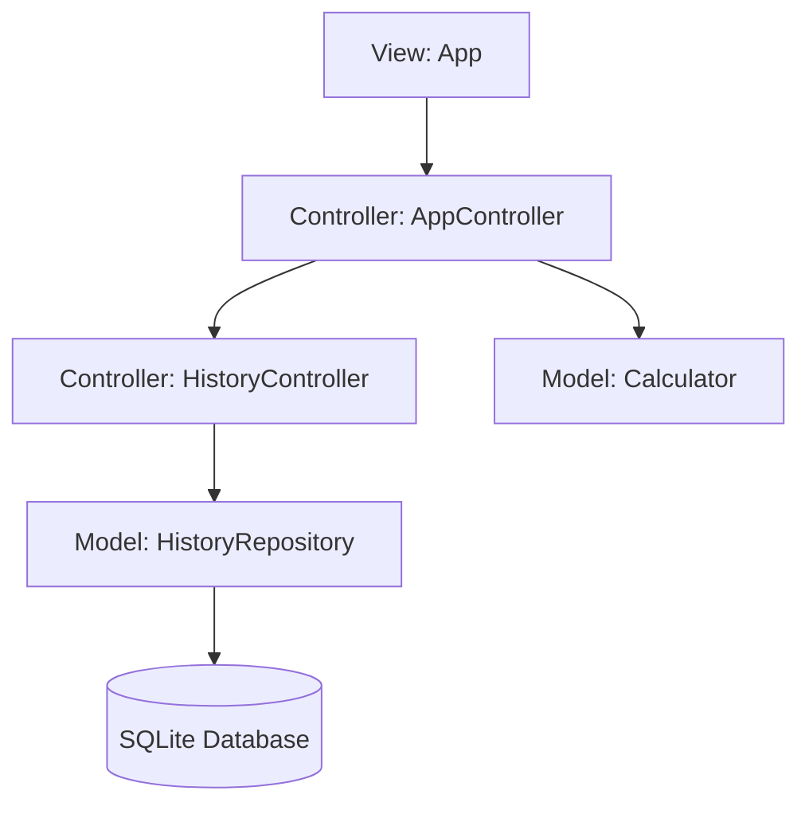

# SQLite History Persistence Plan

This document outlines the design and implementation plan to persist the calculation history in `calc-cli` using SQLite.

---

## 1. Goal

Currently, the evaluation history (`history_`) is stored in-memory inside the `Calculator` model class and is wiped out whenever the application exits. The goal is to persist all successful calculations to a local SQLite database (`~/.calc_cli/calc_history.db`) so that history is preserved across application launches.

---

## 2. Dependency Management (CMake)

We will use the system-provided SQLite3 library, which is pre-installed on macOS and Linux. We can configure CMake to locate and link this library automatically.

### Update `CMakeLists.txt`
```cmake
# Locate system-provided SQLite3
find_package(SQLite3 REQUIRED)

# Link it to the models and controllers
target_link_libraries(calc_lib PUBLIC util_lib SQLite3::SQLite3)
```

> [!NOTE]
> Linking `SQLite3::SQLite3` to `calc_lib` keeps all database interactions encapsulated inside the **Model** layer, ensuring the **Controller** and **View** remain database-agnostic.

---

## 3. Architecture Design: Separate Models & Controllers

To align with the project's strict MVC architecture and the Single Responsibility Principle, we will introduce a new model and a new controller to separate concerns:

* **Calculator** (Model): Remains a pure, stateless math evaluator.
* **HistoryRepository** (Model): Handles SQLite database persistence and holds the in-memory cache of history items.
* **HistoryController** (Controller): Dedicated controller that wraps `HistoryRepository` and exposes history actions (saving, loading, clearing).
* **AppController** (Controller): Coordinates overall app state. It acts as the sole controller interface for the View, delegating all history-related requests to `HistoryController`.

This keeps the View `App` simple and clean, as it only needs to interact with a single controller (`AppController`).



---

## 4. Database Schema

We will store calculations in a table named `history`.

```sql
CREATE TABLE IF NOT EXISTS history (
    id INTEGER PRIMARY KEY AUTOINCREMENT,
    expression TEXT NOT NULL,
    result TEXT NOT NULL,
    timestamp DATETIME DEFAULT CURRENT_TIMESTAMP
);
```

---

## 5. Model Class Design

We will create two new files: `src/model/history_repository.hpp` and `src/model/history_repository.cpp`.

### `src/model/history_repository.hpp`
```cpp
#pragma once

#include <string>
#include <vector>
#include <utility>
#include <sqlite3.h>

class HistoryRepository {
  public:
    explicit HistoryRepository(const std::string& db_path);
    ~HistoryRepository();

    // Disable copy constructors
    HistoryRepository(const HistoryRepository&) = delete;
    HistoryRepository& operator=(const HistoryRepository&) = delete;

    // Load history from the database into the memory cache
    bool Initialize();

    // Save a new calculation and append to memory cache
    bool Add(const std::string& expression, const std::string& result);

    // Delete all records from the database and clear memory cache
    bool Clear();

    // Get read-only access to cached history
    const std::vector<std::pair<std::string, std::string>>& GetHistory() const;

  private:
    std::string db_path_;
    sqlite3* db_ = nullptr;
    std::vector<std::pair<std::string, std::string>> cache_;

    bool ExecuteQuery(const std::string& sql);
};
```

---

## 6. Controller Integration: AppController and HistoryController

We will create a new controller class `HistoryController` to wrap all history-related logic, decoupling it from the main `AppController`.

### `src/controller/history_controller.hpp`
```cpp
#pragma once

#include "model/history_repository.hpp"
#include <string>
#include <vector>
#include <utility>

class HistoryController {
  public:
    explicit HistoryController(HistoryRepository& repo);

    // Save a new calculation to database and cache
    void OnSaveHistory(const std::string& expression, const std::string& result);

    // Clear all history from database and cache
    void OnClearHistory();

    // Read-only access to history cache for the view to render
    const std::vector<std::pair<std::string, std::string>>& GetHistory() const;

  private:
    HistoryRepository& repo_;
};
```

### Refactoring `AppController`
`AppController` will accept a reference to `HistoryController` and act as the conduit between the View and `HistoryController`:
```cpp
class AppController {
  public:
    AppController(AppState& state, Calculator& calc,
                  HistoryController& history_ctrl,
                  std::function<void()> on_quit);

    void OnEvaluate();
    void OnClearHistory();
    const std::vector<std::pair<std::string, std::string>>& GetHistory() const;
    void OnQuit();
    void OnOpenVersion();
    void OnCloseVersion();

  private:
    AppState& state_;
    Calculator& calc_;
    HistoryController& history_ctrl_;
    std::function<void()> on_quit_;
};
```

### Refactoring event handlers in `AppController`
`AppController` handles evaluation and forwards history actions to `HistoryController`:
```cpp
void AppController::OnEvaluate() {
    std::string formatted = util::FormatExpression(state_.expression_input);
    state_.expression_input = formatted;

    EvaluationResult res = calc_.Evaluate(formatted);
    if (res.ok) {
        std::string result_str = util::FormatDouble(res.value);
        state_.result_display = "= " + result_str;
        state_.error_state = false;
        
        // Delegate save to HistoryController
        history_ctrl_.OnSaveHistory(formatted, result_str);
    } else {
        state_.result_display = "Error: " + res.error;
        state_.error_state = true;
    }
}

void AppController::OnClearHistory() {
    // Delegate clear to HistoryController
    history_ctrl_.OnClearHistory();
}

const std::vector<std::pair<std::string, std::string>>&
AppController::GetHistory() const {
    // Delegate fetch to HistoryController
    return history_ctrl_.GetHistory();
}
```

### The View (`App` class) Remains Unchanged
Since `AppController` acts as the conduit, the View `App` in `src/view/app.cpp` does **not** need to change its interface or constructor. It continues to interact only with `AppController`:
```cpp
// In src/view/app.cpp when clearing history (no changes needed):
controller_.OnClearHistory();

// In src/view/app.cpp when rendering the inline history view (no changes needed):
const auto& hist = controller_.GetHistory();
```

---

## 7. Database Path Resolution & Directory Creation

On startup in `main.cpp`, we will determine a persistent path for the database file:
* **macOS/Linux**: `~/.calc_cli/calc_history.db` (resolved via `getenv("HOME")`).
* **Windows**: `%USERPROFILE%\.calc_cli\calc_history.db` (resolved via `getenv("USERPROFILE")`).
* **Fallback**: `./.calc_cli/calc_history.db` if home environment variables are not found.

> [!IMPORTANT]
> SQLite will fail to open a database file if its parent directory does not exist. Therefore, we must use C++17's `<filesystem>` library to ensure the `.calc_cli/` directory is created before initializing the connection.

```cpp
#include <filesystem>

std::string GetDatabasePath() {
    const char* home = std::getenv("HOME");
    if (!home) {
        home = std::getenv("USERPROFILE");
    }
    
    std::string db_dir;
    if (home) {
        db_dir = std::string(home) + "/.calc_cli";
    } else {
        db_dir = ".calc_cli";
    }

    // Ensure the parent directory exists
    std::filesystem::create_directories(db_dir);
    
    return db_dir + "/calc_history.db";
}
```

---

## 8. Testing Strategy

> [!TIP]
> SQLite has built-in support for in-memory databases using the path `":memory:"`. We can write tests for `HistoryRepository` that instantiate the class with `":memory:"` to verify insertion, clearing, and loading operations without creating any physical files.

We will add a new test section in `tests/test_main.cpp`:
```cpp
TEST_CASE("HistoryRepository SQLite Persistence", "[history]") {
    HistoryRepository repo(":memory:");
    REQUIRE(repo.Initialize());

    SECTION("Initially empty") {
        REQUIRE(repo.GetHistory().empty());
    }

    SECTION("Inserting and loading history") {
        REQUIRE(repo.Add("2 + 2", "4"));
        REQUIRE(repo.Add("3 * 5", "15"));
        
        auto history = repo.GetHistory();
        REQUIRE(history.size() == 2);
        REQUIRE(history[0].first == "2 + 2");
        REQUIRE(history[0].second == "4");
    }

    SECTION("Clearing history") {
        repo.Add("2 + 2", "4");
        REQUIRE(repo.Clear());
        REQUIRE(repo.GetHistory().empty());
    }
}
```

---

## 9. Implementation Checklist

- [ ] Modify `CMakeLists.txt` to find and link the system `SQLite3` library. Include `history_controller.cpp` in `controller_lib`.
- [ ] Implement `HistoryRepository` model in `src/model/history_repository.hpp/cpp`.
- [ ] Implement `HistoryController` controller in `src/controller/history_controller.hpp/cpp`.
- [ ] Remove history storage and API from the `Calculator` model.
- [ ] Refactor `AppController` to integrate `HistoryController` and expose delegated methods `OnClearHistory` and `GetHistory`.
- [ ] Add `GetDatabasePath()` helper inside `src/main.cpp`.
- [ ] Initialize and pass the repository and controllers in both interactive and headless paths of `main()`.
- [ ] Write Catch2 tests for `HistoryRepository` and `HistoryController` using `":memory:"`.
- [ ] Compile and verify all tests pass.
