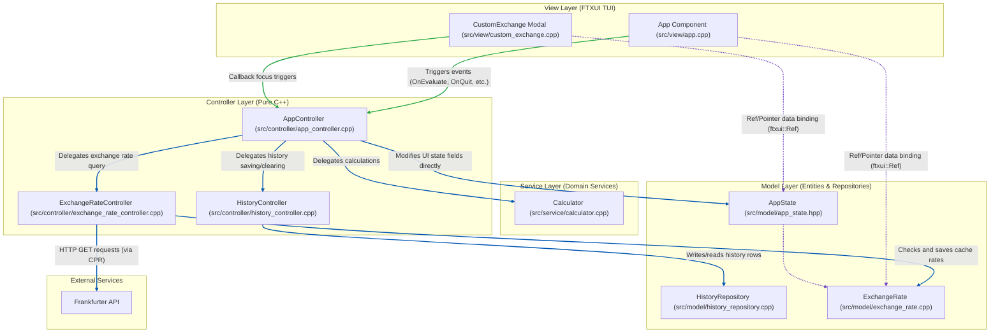
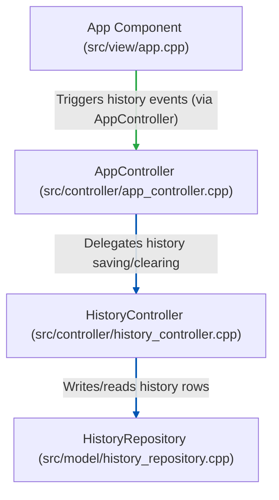
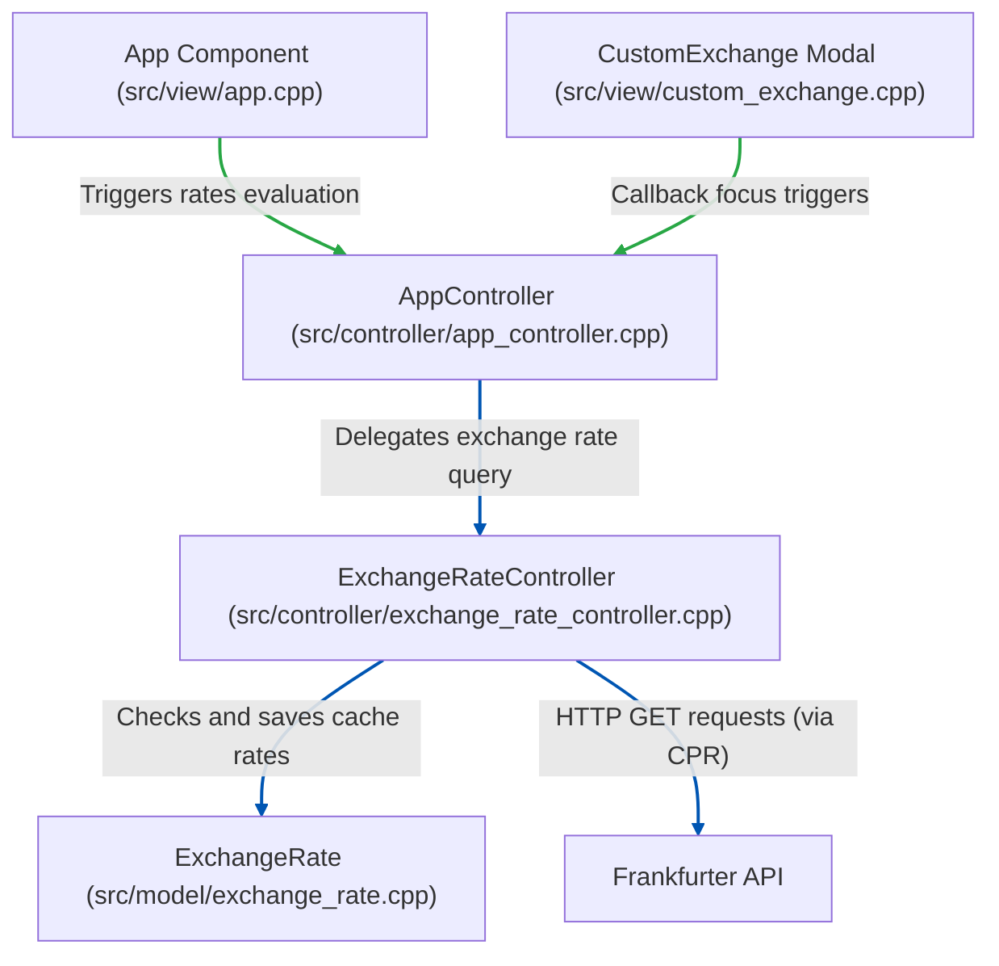
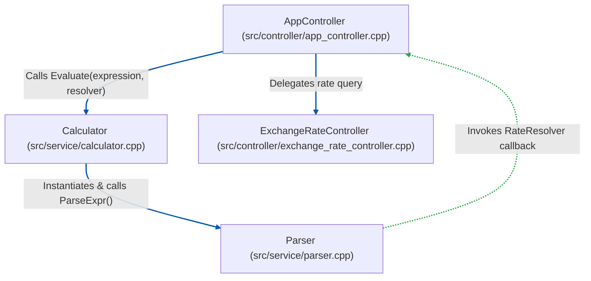
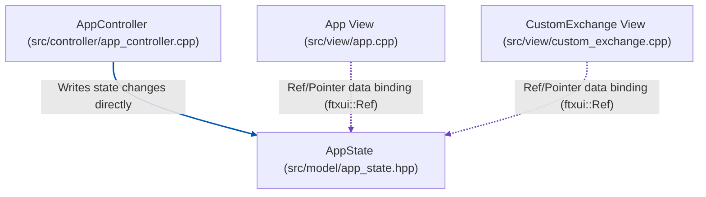
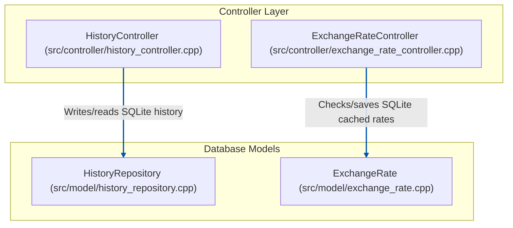

# Architecture & Separation of Concerns

This document details the architectural layers of the `calc-cli` TUI application and how they interact, illustrating the separation of concerns between Model, View, and Controller layers.

---

## 1. Interaction Diagram

Below is a detailed diagram showing the data flow, focus handling, and dependencies across all application layers and components.

---

## 2. Separation of Concerns Breakdown

### View Layer (FTXUI TUI)
* **Components**: [app.cpp](../src/view/app.cpp) and [custom_exchange.cpp](../src/view/custom_exchange.cpp).
* **Role**: Orchestrates visual elements and coordinates TUI layout construction, borders, menus, scrolling, and focus transitions.
* **Separation Rule**: **No business logic or direct mathematical calculations.** It does not validate strings or parse exchange tokens. Every user action (like pressing Return to evaluate or Tab to clear) delegates to the Controller layer. It observes the Model layer reactively through pointers bound via `ftxui::Ref`.

### Controller Layer (Pure C++)
The controller layer manages data coordinating tasks, separated into a central app flow coordinator and specialized domain sub-controllers:
* **AppController** ([app_controller.cpp](../src/controller/app_controller.cpp)):
  Coordinates UI lifecycle actions, triggers evaluation operations, keeps the state's calculations history synchronised, and handles quit modal events.
* **HistoryController** ([history_controller.cpp](../src/controller/history_controller.cpp)):
  Mediates saving, reading, and clearing history transactions against the database model.
* **ExchangeRateController** ([exchange_rate_controller.cpp](../src/controller/exchange_rate_controller.cpp)):
  Manages cached exchange rate validation and coordinates fallback scenarios or Frankfurter API network downloads.
* **Separation Rule**: **Zero TUI/FTXUI library dependencies.** The controllers can compile and run in a pure console environment (or unit tests) without pulling in screen formatting, color decorators, or layout coordinates.

### Service Layer (Pure C++ Domain Services)
* **Calculator** ([calculator.cpp](../src/service/calculator.cpp)):
  Coordinates expression evaluation and exposes the main calculation entry point.
* **Parser** ([parser.cpp](../src/service/parser.cpp)):
  Internal recursive-descent parser that parses infix math tokens and evaluates expression syntax.
* **Separation Rule**: **Stateless & logic-focused.** Service components have no awareness of UI state lifecycles, database structures, or configuration layouts.

### Model Layer (Pure C++ Entities & Repositories)
* **AppState** ([app_state.hpp](../src/model/app_state.hpp)):
  Flat state structure holding TUI parameters like expression inputs, cursor index, visibility toggles, and selection indexes.
* **HistoryRepository** ([history_repository.cpp](../src/model/history_repository.cpp)):
  Raw SQLite interface executing `INSERT`, `SELECT`, and `DELETE` queries on the history table.
* **ExchangeRate** ([exchange_rate.cpp](../src/model/exchange_rate.cpp)):
  Raw SQLite interface executing cached rate retrievals and updates.
* **Separation Rule**: **Stateless & UI-independent.** Model components have no awareness of user focus, active menu items, window size, or mouse clicks. They accept queries/expressions, execute computational actions, write results to database tables, and return structured result formats.

---

## 3. Sub-Controller Deep Dives

While the main Interaction Diagram shows the global layout, this section details the focused responsibilities and interaction flows of the specialized sub-controllers, starting from the initiating Views that trigger the actions.

### A. HistoryController Flow

The `HistoryController` mediates operations between user requests in the UI and the SQLite history repository.

* **Flow & Responsibilities**:
  * **Trigger**: User inputs are entered or history-clearing options are clicked in the `App` View component.
  * **Routing**: The `App` View calls the `AppController`, which coordinates UI state adjustments and delegates data operations to the `HistoryController`.
  * **Action**: The `HistoryController` executes transaction commands and persists calculations data to the SQLite database via the `HistoryRepository`.

---

### B. ExchangeRateController Flow

The `ExchangeRateController` manages rate-retrieval flow, querying local SQLite cache data or performing external API fetches as fallback.

* **Flow & Responsibilities**:
  * **Trigger**: The user selects standard currency conversion (AUD $\rightarrow$ USD) in the `App` View menu, or enters a custom exchange pair in the `CustomExchange` modal.
  * **Routing**: The view components trigger action handlers on the `AppController`, which forwards the currency queries to the `ExchangeRateController`.
  * **Action**: The `ExchangeRateController` checks local cache tables via the `ExchangeRate` model. If not found or outdated, it uses CPR to fetch live currency rates from the `Frankfurter API` and cache them for future offline queries.

---

## 4. Domain Service Deep Dives

This section details how core math parsing and logic processes are encapsulated within stateless domain services.

### A. Calculator & Parser Flow (Domain Services)

The `Calculator` serves as the entry point for calculations, parsing expression strings using the internal `Parser` class. Both components remain completely decoupled from SQL databases or network clients by leveraging a callback function interface.

* **Responsibilities & Callbacks**:
  * **Calculator**: Exposes the main arithmetic evaluation function, catching parsing exceptions and translating outputs into standard `EvaluationResult` structs.
  * **Parser**: An internal recursive-descent syntax parser that runs token scanning and directly evaluates math rules. When it encounters currency exchange tokens, it invokes the `RateResolver` callback.
  * **Callback Wiring**: The `AppController` sets up this callback at evaluation time, resolving rates by delegating the query to the `ExchangeRateController`.

---

## 5. Model Layer Deep Dives

This section details how application state and database transactions are encapsulated within the Model layer, and how they remain isolated from UI logic.

### A. AppState (UI State Model)

`AppState` is a simple, flat data structure containing the active parameters of the TUI. It does not contain any behaviors or layout logic.

* **Responsibilities & Binding**:
  * **Decoupled Storage**: Holds visibility flags (e.g. `show_custom_modal`), raw expression text, and scrolling cursor/selection indices.
  * **Direct Modification**: The `AppController` writes state modifications directly based on user inputs or business logic evaluations.
  * **Reactive Read**: View components (`App` and `CustomExchange`) bind directly to these variables via `ftxui::Ref` pointers, allowing the screen to repaint automatically when state variables change without manual view-updates.

### B. Database Repositories (History & Cache Models)

`HistoryRepository` and `ExchangeRate` encapsulate SQLite interface tables, shielding the rest of the application from direct SQL query constructs and database connections.

* **Responsibilities**:
  * **HistoryRepository**: Prepares and executes raw SQLite statements (`INSERT`, `SELECT`, `DELETE`) on the calculations history rows.
  * **ExchangeRate**: Manages cached exchange tables. It reads and writes valid rate entries, insulating controllers from raw SQL statements.

---

## 6. Appendix: Diagram Style Guide

This appendix serves as a behavioral reference for maintaining architecture diagrams within this repository.

### A. Color Key

| Color | Hex Code | Meaning / Usage | Example |
|---|---|---|---|
| **Green** | `#28a745` | Events and callback triggers | `App --> AppCtrl`, `Parser -.-> AppCtrl` |
| **Purple** | `#6f42c1` | Data binding | `App -.-> ExchRepo`, `CustomExchange -.-> State` |
| **Darker Blue** | `#0056b3` | All other lines (delegation, databases, API queries) | `AppCtrl --> Calc`, `HistCtrl --> HistRepo` |
| **Monochrome** | *Standard* | Structural borders, groups, components | `subgraph View` |

### B. Strict UML Standards
* **Dependency Rule**: Arrows must always point from the **Client** (the component holding the reference or triggering the event) to the **Supplier** (the component being referenced or serving the request).
* **Reference Direction**: Data binding references (like `ftxui::Ref` bindings) must point from the View/Component observing the value to the State/Repository model holding the value (e.g., `App -.-> ExchRepo`).

### C. Mermaid linkStyle Indices
When adding or updating connections in diagrams:
1. Determine the 0-based index of the connection by counting the sequential declaration of all arrows (e.g. `-->`, `-.->`) in the Mermaid code block.
2. Apply styles at the bottom of the block using `linkStyle <indices> stroke:#<hex>,stroke-width:2px;`.

