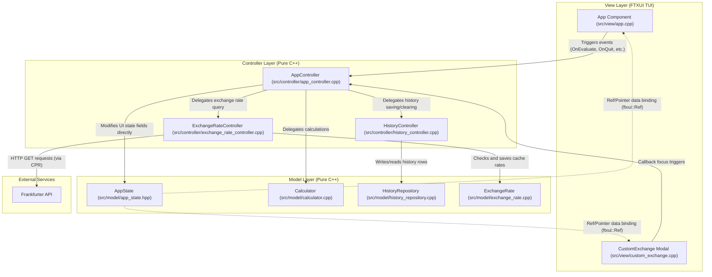

# Architecture & Separation of Concerns

This document details the architectural layers of the `calc-cli` TUI application and how they interact, illustrating the separation of concerns between Model, View, and Controller layers.

---

## 1. Interaction Diagram

Below is a detailed diagram showing the data flow, focus handling, and dependencies across all application layers and components.

---

## 2. Separation of Concerns Breakdown

### View Layer (FTXUI TUI)
* **Components**: [app.cpp](../src/view/app.cpp) and [custom_exchange.cpp](../src/view/custom_exchange.cpp).
* **Role**: Orchestrates visual elements and coordinates TUI layout construction, borders, menus, scrolling, and focus transitions.
* **Separation Rule**: **No business logic or direct mathematical calculations.** It does not validate strings or parse exchange tokens. Every user action (like pressing Return to evaluate or Tab to clear) delegates to the Controller layer. It observes the Model layer reactively through pointers bound via `ftxui::Ref`.

### Controller Layer (Pure C++)
The controller layer manages data coordinating tasks, separated into a central app flow coordinator and specialized domain sub-controllers:
* **AppController** ([app_controller.cpp](../src/controller/app_controller.cpp)):
  Coordinates UI lifecycle actions, triggers evaluation operations, keeps the state's calculations history synchronised, and handles quit modal events.
* **HistoryController** ([history_controller.cpp](../src/controller/history_controller.cpp)):
  Mediates saving, reading, and clearing history transactions against the database model.
* **ExchangeRateController** ([exchange_rate_controller.cpp](../src/controller/exchange_rate_controller.cpp)):
  Manages cached exchange rate validation and coordinates fallback scenarios or Frankfurter API network downloads.
* **Separation Rule**: **Zero TUI/FTXUI library dependencies.** The controllers can compile and run in a pure console environment (or unit tests) without pulling in screen formatting, color decorators, or layout coordinates.

### Model Layer (Pure C++)
* **AppState** ([app_state.hpp](../src/model/app_state.hpp)):
  Flat state structure holding TUI parameters like expression inputs, cursor index, visibility toggles, and selection indexes.
* **Calculator** ([calculator.cpp](../src/model/calculator.cpp)):
  Runs expression parsing and evaluates values using the `RateResolver` callback interface.
* **HistoryRepository** ([history_repository.cpp](../src/model/history_repository.cpp)):
  Raw SQLite interface executing `INSERT`, `SELECT`, and `DELETE` queries on the history table.
* **ExchangeRate** ([exchange_rate.cpp](../src/model/exchange_rate.cpp)):
  Raw SQLite interface executing cached rate retrievals and updates.
* **Separation Rule**: **Stateless & UI-independent.** Model components have no awareness of user focus, active menu items, window size, or mouse clicks. They accept queries/expressions, execute computational actions, write results to database tables, and return structured result formats.
